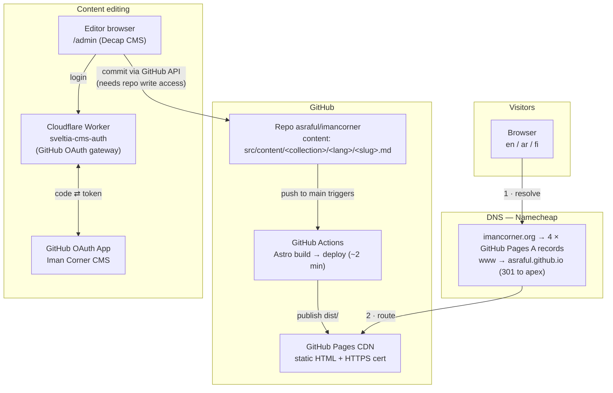
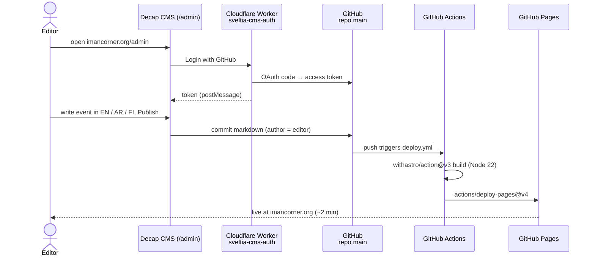

# Iman Corner

Trilingual (English / العربية / Suomi) community events site, live at
**[imancorner.org](https://imancorner.org)**.

Fully static Astro site, hosted free on GitHub Pages, with browser-based content
editing through Decap CMS at [imancorner.org/admin](https://imancorner.org/admin/).
Full setup details and troubleshooting live in [docs/SETUP.md](docs/SETUP.md).

## Architecture



**Key properties**

- **No servers to run.** The site is prebuilt HTML on GitHub Pages; the only moving part
  is a ~50-line Cloudflare Worker that performs the CMS login handshake.
- **Git is the database.** Every event and page is a markdown file; every edit — CMS or
  manual — is a commit with an author, so history and rollback come free.
- **Access control = repo permissions.** Anyone with write access to this repo can log
  in to `/admin` with their own GitHub account; nobody else can publish.

## Content & i18n model

One entry = one event or page, translated in place. The CMS edits all three languages in
a single editor (Decap i18n, `multiple_folders`); each language saves to its own folder
and translations share a filename, which is also the URL slug:

```
src/content/events/en/eid-gathering-2026.md   →  /en/events/eid-gathering-2026/
src/content/events/ar/eid-gathering-2026.md   →  /ar/events/eid-gathering-2026/
src/content/events/fi/eid-gathering-2026.md   →  /fi/events/eid-gathering-2026/
```

Language and slug are derived from the path — not frontmatter. Standalone **Pages**
(About, Contact, …) work the same way at `/<lang>/<slug>/`, with optional
`showInNav`/`navOrder` to appear in the header menu. Drafts (`isDraft`) never publish.

## Ops — how a change goes live



The same pipeline runs for manual edits: change any file on `main` (locally or on
github.com) and the site redeploys automatically.

## Infrastructure reference

| Piece | Where | Notes |
|---|---|---|
| Hosting | GitHub Pages (workflow deploys) | Custom domain `imancorner.org`, Enforce HTTPS on |
| Build | `.github/workflows/deploy.yml` | Astro 7 needs `node-version: 22` |
| DNS | Namecheap (BasicDNS) | Apex A records + `www` CNAME, see diagram |
| CMS | Decap CMS 3 (`public/admin/`) | Single trilingual Events + Pages collections |
| CMS auth | `sveltia-cms-auth.imancorner.workers.dev` | Cloudflare Worker, account `imancorner.org@gmail.com` |
| OAuth app | "Iman Corner CMS" (GitHub) | Callback → worker `/callback` |
| Sister site | [tamperequrancompetition.imancorner.org](https://tamperequrancompetition.imancorner.org) | Separate repo [asraful/tamperequrancompetition](https://github.com/asraful/tamperequrancompetition) |

## Local development

```bash
npm install
npm run dev      # dev server at localhost:4321
npm run build    # production build to dist/
npm run check    # type-check
```

Built with [Astro 7](https://astro.build) · [Alpine.js](https://alpinejs.dev) ·
[Decap CMS](https://decapcms.org)
